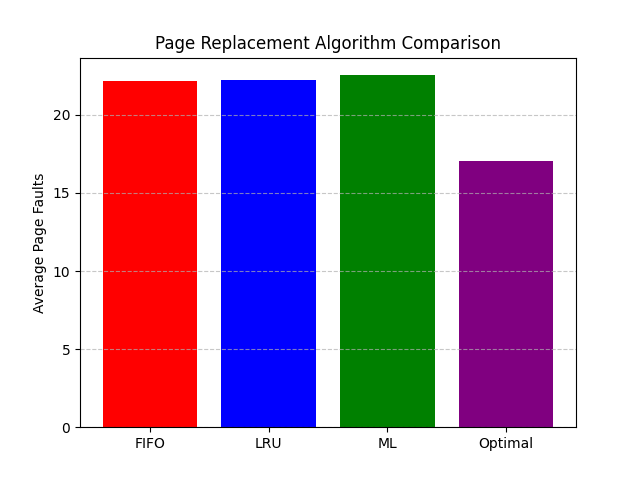
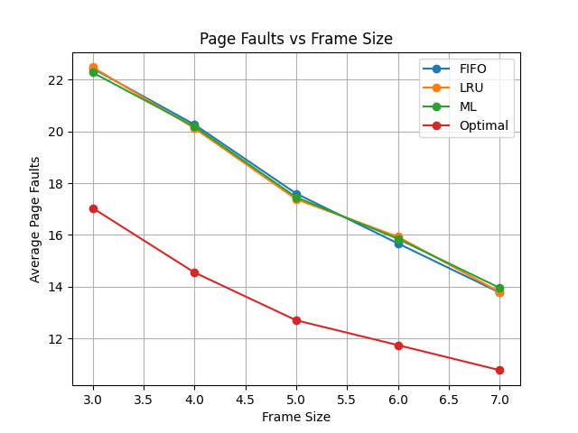
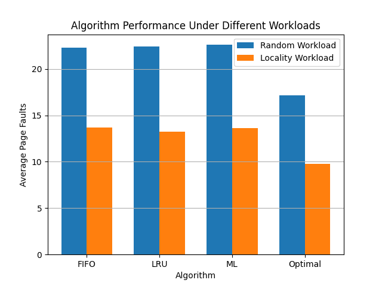
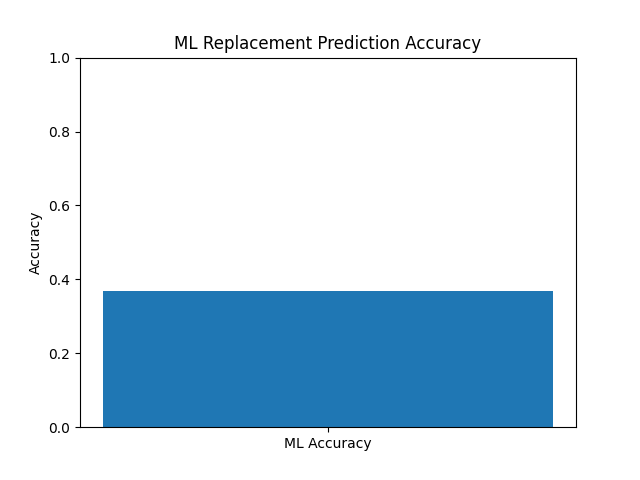

# ML-Based Predictive Page Replacement Policy

## Overview

Traditional operating systems use heuristic-based page replacement algorithms such as FIFO and LRU. These approaches rely only on past memory access patterns and cannot predict future accesses.

This project explores whether **Machine Learning can approximate the Optimal (Belady) page replacement policy** by learning from simulated memory access workloads.

The system generates memory reference strings, collects Optimal eviction decisions, trains a machine learning model, and evaluates its performance against classical page replacement algorithms.

---

## Implemented Algorithms

* FIFO (First-In First-Out)
* LRU (Least Recently Used)
* Optimal (Belady’s algorithm)
* ML-Based Replacement Policy

---

## Machine Learning Approach

1. Generate memory reference workloads.
2. Record Optimal eviction decisions.
3. Train a **Random Forest classifier** using:

Features:

* frame1
* frame2
* frame3
* next_page

Target:

* page to evict

4. Integrate the trained model as a page replacement policy.

---

## Experiments

The system performs multiple experiments and compares algorithm performance.

### Algorithm Comparison



---

### Page Faults vs Frame Size



---

### Workload Comparison (Random vs Locality)



---

### ML Prediction Accuracy



---

## Tech Stack

* Python
* Scikit-learn
* Matplotlib
* Operating Systems Simulation

---

## How to Run

Clone the repository:

```
git clone <repo-link>
cd ml-page-replacement
```

Install dependencies:

```
pip install -r requirements.txt
```

Run experiments:

```
python main.py
```

---

## Future Improvements

* Add temporal features (recency distance, frequency)
* Explore sequence models such as LSTM
* Evaluate performance on larger frame sizes
* Integrate locality-aware workload generators
